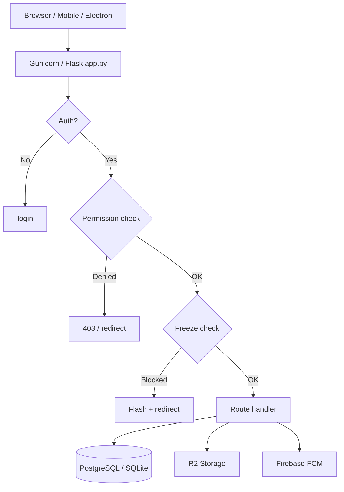
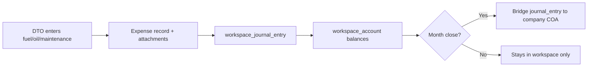
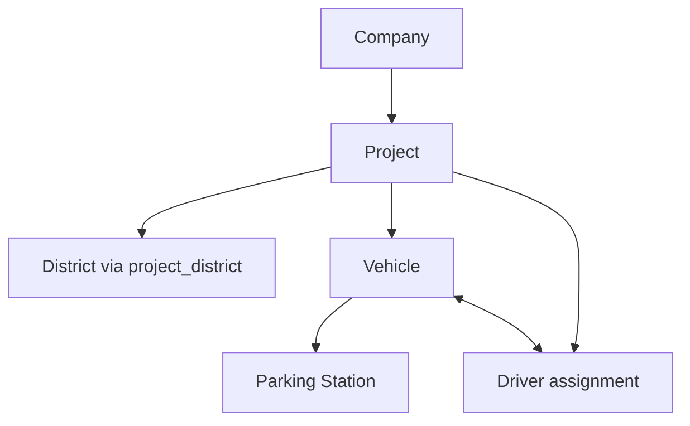

# Project Knowledge Base — Company Management / Fleet Manager

> **Purpose:** Durable context for future development. Read this before changing routes, finance, workspace, attendance, or permissions.
>
> **Last analyzed:** 2026-06-05 | **Stack:** Python 3 + Flask 3.1 + SQLAlchemy 2 + PostgreSQL (prod) / SQLite (local)

---

## 1. What This System Is

A **production fleet & company management ERP** for ambulance/emergency fleet operations in Pakistan. It manages:

- Master data (companies, projects, districts, vehicles, drivers, employees)
- Fleet assignments and transfers
- GPS + camera driver attendance
- Daily tasks, logbooks, mileage, tracker reports
- Fuel / oil / maintenance expenses with photo attachments
- **Two-tier accounting:** company-level finance + per-employee isolated workspace books
- Payroll (attendance-based)
- Physical logbook inventory
- Mobile app (Capacitor Android/iOS), PWA, Electron desktop shell
- Push notifications, scheduled backups, AI SQL assistant

**Timezone:** `Asia/Karachi` (`APP_TIMEZONE`). Dates display as `dd-mm-yyyy`.

**Deployment:** Render (Gunicorn + managed PostgreSQL). Local dev uses `db/local.db` via `LOCAL_DB_GUARANTEED`.

---

## 2. Entry Points & Boot Sequence

| File | Role |
|------|------|
| `app.py` | Flask factory: config, DB, CSRF, migrations, context processors, route registration, schedulers |
| `routes.py` | Monolith (~35K lines): fleet, attendance, expenses, reports, auth, admin |
| `routes_finance.py` | Company accounting (vouchers, COA, wallets) |
| `routes_workspace.py` | Per-employee isolated books |
| `routes_payroll.py` | Salary config, payroll lifecycle |
| `routes_books.py` | Physical book stock/issue/return |
| `routes_ai.py` | Gemini "Master Mind" read-only SQL assistant |
| `routes_tool_workstation.py` | 120 browser utility tools |
| `api.py` | JWT mobile API at `/api/v1/` |

**Load order:** `routes` → `routes_tool_workstation` → `register_book_routes()` → finance/workspace/payroll URL rules in `app.py` → `api_bp` → `ai_bp`.

**Startup tasks** (non-debug or Werkzeug main process):
1. `db.create_all()` + inline `ALTER TABLE` column backfills
2. `flask db upgrade` (Alembic)
3. R2 CORS sync for direct browser uploads
4. Auth/permission seed, CoA seed, employee assignment backfill
5. APScheduler: backup, attendance reminders, expiry reminders

---

## 3. Folder Structure (Essential)

```
company_management/
├── app.py                 # Application factory
├── models.py              # 92 ORM models (~2770 lines) — schema source of truth
├── forms.py               # 83 WTForms classes
├── routes.py              # Main route monolith
├── routes_*.py            # Split modules (finance, workspace, payroll, books, ai, tool)
├── finance_utils.py       # Double-entry journal logic (company + workspace)
├── auth_utils.py          # RBAC, login, permission seeding
├── permissions_config.py  # Permission tree + visibility helpers
├── hub_registry.py        # Sidebar module hubs
├── freeze_utils.py        # Date-based write freeze
├── utils.py               # PK timezone, CSV/Excel, CNIC/phone formatters
├── api.py                 # Mobile REST API
├── migrations/versions/   # 79+ Alembic migrations
├── templates/             # 312 Jinja2 templates
├── static/                # CSS, JS, PWA, APKs
├── db/local.db            # Local SQLite (gitignored)
├── android/               # Capacitor native
├── fleet-desktop/         # Electron wrapper
├── daedalOS/              # Embedded faux-OS for admin Personal Tools
├── tool_workstation/      # Tool registry (120 utilities)
├── docs/                  # Architecture & feature docs
└── scripts/               # Render deploy, env, build helpers
```

---

## 4. Database Design Summary

**~97 tables** defined in `models.py`. Access is overwhelmingly ORM; raw SQL used for AI queries, schema hotfixes, and `sync_master.py`.

### Entity Groups

| Domain | Key Tables | Relationships |
|--------|-----------|---------------|
| Organization | `company`, `project`, `district`, `parking_station` | Project → Company; Project ↔ District (M:N) |
| Fleet | `vehicle`, `driver` | Vehicle ↔ Driver (circular assignment); both → Project, District |
| Workforce | `employee`, `employee_post`, `employee_assignment` | Employee ↔ Project/District (M:N); lifecycle history |
| Attendance | `driver_attendance`, `attendance_settings`, `leave_request` | Driver + date + segment (morning/night) unique |
| Tasks | `vehicle_daily_task`, `emergency_task_record`, `vehicle_mileage_record`, `red_task`, `vehicle_move_without_task` | Linked to vehicle/project/district |
| Expenses | `fuel_expense`, `oil_expense`, `maintenance_expense`, `maintenance_work_order` | → district, project, employee, vehicle, party |
| Company Finance | `account`, `journal_entry`, `journal_entry_line`, vouchers, `fund_transfer` | Double-entry; wallet per district-project |
| Workspace | `workspace_*` (party, product, account, journal, expense, month_close) | Scoped by `employee_id`; bridge to company on month close |
| Payroll | `employee_salary_config`, `monthly_payroll` | Employee OR driver per record |
| Auth | `user`, `role`, `permission`, `role_permissions` | Hierarchical RBAC |
| Ops | `notification`, `fleet_backup_job`, `tracker_automation_job`, `device_fcm_token` | Infrastructure |

### Dual Accounting Model (Critical)

```
Daily ops (DTO/employee)  →  workspace_journal_entry  (isolated)
Month close               →  ONE bridge journal_entry  (company books)
```

See `docs/employee_workspace_dependency_matrix.md` for isolation contracts.

**Legacy tables** `party` and `product` remain for company-level expenses; workspace uses `workspace_party` / `workspace_product`.

---

## 5. Module Hub Map

Navigation uses `hub_registry.HUBS` → `/hub/<slug>` landing pages.

| Hub Slug | Domain |
|----------|--------|
| `master-data` | Companies, projects, districts, vehicles, parking, employees, drivers |
| `assignments` | Project↔company, district↔project, vehicle↔district/parking, driver↔vehicle |
| `transfers` | Project, vehicle, driver transfers |
| `workforce` | Driver job left/rejoin, penalties, employee lifecycle |
| `attendance` | GPS check-in/out, leave, bulk status, reports |
| `task-logbook` | Task upload/entry, red tasks, mileage, tracker reports |
| `finance` | COA, vouchers, fund transfers, wallet dashboard, ledger |
| `payroll` | Salary config, generate, finalize, pay, payslips |
| `books` | Physical logbook inventory |
| `notifications` | System notifications + personal reminders |
| `administration` | Users, roles, settings, health, app releases, personal tools |

**Employee Workspace** is a separate sidebar section (`/workspace/*`), not a hub tile — it wraps expense forms scoped to a selected employee.

---

## 6. Forms & Templates

### WTForms (`forms.py` — 83 classes)

Grouped by: Master, Assignment, Transfer, Workforce, Attendance, Tasks, Expenses, Finance, Payroll, Books, Auth/Admin.

### Templates (312 files)

| Folder | Count | Purpose |
|--------|-------|---------|
| `templates/` (root) | ~225 | Fleet ops, reports, admin |
| `templates/workspace/` | 39 | Employee workspace accounting |
| `templates/finance/` | 21 | Company finance |
| `templates/payroll/` | 11 | Payroll & payslips |
| `templates/books/` | 6 | Book management |
| `templates/tool_workstation/` | 3 | Browser tools |

**Layouts:** `base.html` (main app), `base_print.html`, `login_base.html`, `module_hub.html`.

---

## 7. Key Business Rules

### Authentication & Authorization
- Session-based web auth; JWT for mobile API (`api.py`)
- RBAC via `permissions_config.PERMISSION_TREE` — section → page → action
- `is_master` bypasses all permission checks
- Employee-linked users scoped to assigned projects/districts via `auth_utils.get_user_context()`
- Web inactivity timeout: 15 min (configurable); mobile uses biometric re-auth

### Data Freeze (`freeze_utils.py`)
- Admin can freeze writes before/after configurable dates
- Per-endpoint catalog (`FREEZE_FORM_CATALOG`) — matrix UI in Form Control settings
- Reports/lists generally exempt; POST mutations blocked

### Attendance
- Morning + night segments per driver per day (unique constraint)
- GPS geofence validation against parking station coordinates
- Front-camera selfie with GPS stamp overlay (`docs/ATTENDANCE_CAMERA.md`)
- Time windows from `attendance_time_control` + per-scope overrides
- Statuses: Present, Absent, Leave, Late, Half Day, Off, etc.

### Tasks & Compliance
- Daily task entry: odometer readings, task counts
- Excel workbook upload for emergency tasks + mileage
- Red tasks, movement-without-task, unexecuted tasks → penalty linkage
- Tracker automation (Playwright) downloads GPS data from TrackingWorld portal

### Expenses
- Fuel/oil/maintenance tied to vehicle, district, project, employee (DTO)
- Attachments stored locally + Cloudflare R2 (`r2_storage.py`)
- Async upload with manifest status tracking
- Workspace expenses post to `workspace_journal_entry`; company JE on month close only
- Month close blocks edits for closed periods

### Finance (Company)
- Double-entry: every voucher creates `journal_entry` + lines
- DTO wallets per district-project combination
- Party ledgers for vendors (fuel pumps, workshops)
- Fund transfers between company/driver/employee/party wallets

### Payroll
- `EmployeeSalaryConfig`: basic_salary, extra_day_rate, absent_penalty_rate
- Attendance stats pulled from `driver_attendance` for month
- Formula: `gross = basic + (extra_days × rate) + bonus`; deductions include absent × penalty_rate
- Workflow: Draft → Finalized → Paid (creates journal entry on pay)

---

## 8. Data Flow Diagrams

### Request Lifecycle


### Expense → Accounting Flow


### Fleet Assignment Chain


---

## 9. Important Functions & Variables

| Symbol | Location | Purpose |
|--------|----------|---------|
| `create_journal_entry()` | `finance_utils.py` | Company double-entry posting |
| `workspace_create_journal_entry()` | `finance_utils.py` | Workspace posting |
| `workspace_close_month()` | `finance_utils.py` | Period close + company bridge |
| `get_user_context()` | `auth_utils.py` | Project/district scope for user |
| `get_required_permission()` | `auth_utils.py` | Endpoint → permission code |
| `evaluate_freeze()` | `freeze_utils.py` | Date freeze validation |
| `pk_now()`, `pk_date()` | `utils.py` | Pakistan timezone helpers |
| `HUBS`, `ENDPOINT_TO_HUB_SLUG` | `hub_registry.py` | Navigation mapping |
| `PERMISSION_TREE` | `permissions_config.py` | Full permission hierarchy |
| `session['workspace_employee_id']` | Flask session | Selected DTO for workspace |
| `DATABASE_URL` | env | DB connection string |
| `LOCAL_DB_GUARANTEED` | env | Forces `db/local.db` in dev |

---

## 10. Dependencies

### Python (`requirements.txt`)
Flask 3.1, Flask-SQLAlchemy, Flask-Migrate, Flask-WTF, psycopg2-binary, gunicorn, pandas, openpyxl, XlsxWriter, boto3 (R2), firebase-admin, APScheduler, Pillow, pypdf, pytesseract, playwright, PyJWT, cryptography.

### Node (`package.json`)
Capacitor 6 (core, android, ios, geolocation, camera, push-notifications, biometric-auth).

### External Services
- **Render:** hosting + PostgreSQL
- **Cloudflare R2:** file uploads
- **Firebase:** push notifications
- **Google Gemini:** AI assistant SQL generation

---

## 11. Known Issues & Optimization Opportunities

### Architecture
| Issue | Severity | Notes |
|-------|----------|-------|
| `routes.py` ~35K lines | High | Split into blueprints; hardest maintenance surface |
| Triple schema management | Medium | Alembic + `app.py` ALTER + `routes.py` runtime DDL overlap |
| Startup `DROP TABLE` on schema mismatch | High | `emergency_task_record` / `vehicle_mileage_record` can lose data |
| `FINANCE_IMPLEMENTATION_STATUS.md` outdated | Low | Says forms/routes pending; they exist |

### Code Quality
| Issue | Location | Notes |
|-------|----------|-------|
| DEBUG `print()` statements | `auth_utils.py`, `routes.py` | Should use logger or be removed |
| Broad `except Exception` (~100+) | `routes.py` | Masks real errors |
| Circular FK | `vehicle.driver_id` ↔ `driver.vehicle_id` | Assignment sync complexity |
| Legacy `party_list`/`product_list` | `routes.py` | Coexist with workspace; sidebar points to workspace |
| `workspace_product.product_seq` | DB only | Column in migration, not in `models.py` |
| Archive route copies | `docs/archive/` | Old snapshots may confuse grep/search |

### Performance
- Notification badge cached 60s per user (good)
- PostgreSQL connection pool: 10 + 20 overflow
- Gunicorn: 1 worker, 4 threads (Render free tier RAM constraint)
- Consider pagination audit on large list views in `routes.py`

---

## 12. Assumptions & Clarifications Needed

| # | Topic | Assumption | Needs Confirmation |
|---|-------|-----------|-------------------|
| 1 | Business domain | Ambulance/emergency fleet in Pakistan | Company name, operational scope |
| 2 | DTO role | Employee (DTO) manages district-project wallet via workspace | Exact DTO ↔ employee mapping rules |
| 3 | Driver vs Employee payroll | Both use `EmployeeSalaryConfig` (employee_id OR driver_id) | Are drivers always separate from employees table? |
| 4 | Morning/night attendance | Two segments per day per driver | Is partial-day leave handled across segments? |
| 5 | Month close | Bridge JE posts summarized expenses to company | Which company account is default? Reversal rules? |
| 6 | Legacy party/product | Still used by company expense paths | Migration timeline to full workspace? |
| 7 | Project scope | Users see only assigned projects/districts | Master/admin override rules |
| 8 | Fine amounts | Red task, without-task, penalty records link to `penalty_record` | Auto-fine calculation rules vs manual |
| 9 | MPG fines in payroll | `mpg_fine` field exists | How is MPG fine calculated? From workspace MPG report? |
| 10 | Tracker automation | Playwright bot for TrackingWorld | Credentials storage, schedule, failure handling |
| 11 | Oil limits | Form control tab `oil_limits` | Exact limit rules per vehicle/product |
| 12 | Multi-company | Companies own projects | Cross-company reporting needed? |

---

## 13. User Workflows (Typical)

### DTO (District Transport Officer) Daily
1. Login → select workspace employee (if admin acting for DTO)
2. Driver check-in verification / mark attendance exceptions
3. Enter daily tasks or review uploaded workbook data
4. Record fuel/oil/maintenance expenses with photos
5. Review workspace ledger / fund transfers
6. End of month: fuel/oil close → general month close → bridge to company

### HQ Admin
1. Dashboard KPIs → master data maintenance
2. Assign projects, vehicles, drivers
3. Finance: fund transfers to DTO wallets, payment vouchers
4. Payroll: generate → finalize → pay
5. Reports centre: operational + compliance reports
6. Administration: users, roles, freeze settings, backups

### Driver (Mobile)
1. Biometric/login via Capacitor app
2. GPS check-in (morning) / check-out (night) with selfie
3. View notifications
4. (Limited) profile access via API

---

## 14. Before Making Changes — Checklist

1. Read relevant section of this doc + `permissions_config.py` for RBAC impact
2. Check `freeze_utils.FREEZE_FORM_CATALOG` if adding POST endpoints
3. Determine if change affects **company** or **workspace** books (never mix daily posting)
4. Add Alembic migration for schema changes — avoid relying on `app.py` ALTER fallbacks
5. Register new routes in `hub_registry.py` `extra_endpoints` for correct nav highlighting
6. Map endpoint in `auth_utils` permission table
7. Match existing template/form patterns in sibling files
8. Test with both SQLite (local) and PostgreSQL semantics if using raw SQL

---

## 15. Related Docs

| File | Content |
|------|---------|
| `FINANCE_SCHEMA.md` | Company accounting schema design |
| `FINANCE_IMPLEMENTATION_STATUS.md` | Phase tracking (partially stale) |
| `docs/employee_workspace_dependency_matrix.md` | Workspace isolation contracts |
| `docs/ATTENDANCE_CAMERA.md` | GPS/camera attendance implementation |
| `docs/CURSOR_HUB_NAVIGATION_PROMPT.md` | Hub navigation design notes |

---

*This document is analysis-only. No code was modified during its creation.*
